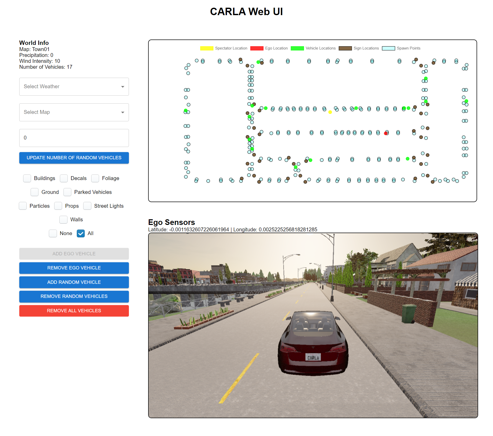

# CARLA Web UI

A web interface for controlling the CARLA simulator.

## Dependencies

1. Download the CARLA simulator from [here](https://github.com/carla-simulator/carla/releases/tag/0.9.15)

2. Conda:
    - Install conda from [here](https://docs.conda.io/projects/conda/en/latest/user-guide/install/index.html)
    - Create a new conda environment: `conda create -n carla-webui python=3.8.18`
    - Activate the conda environment: `conda activate carla-webui`

3. Install the required packages: `pip install -r requirements.txt`

4. Install Git:

    - Install Git from [here](https://git-scm.com/downloads)

5. Code from this repository
    - preferred way: using git: `git clone https://github.com/mateus-aleixo/carla-webui.git`.
      - This way is preferred because it lets you update by just running `git pull`.
      - Those commands can be used from command line window that opens after you right click in Explorer and select "Git Bash here".
    - alternative way: use the "Code" (green button) -> "Download ZIP" option on the main page of the repo.
      - You won't need to install git if you choose this.
      - To update, you'll have to download zip again and replace files.

## Installing and Running

### Windows

Run `webui.bat` from Windows Explorer as normal, non-administrator, user.

### Linux

Run `webui.sh`.
