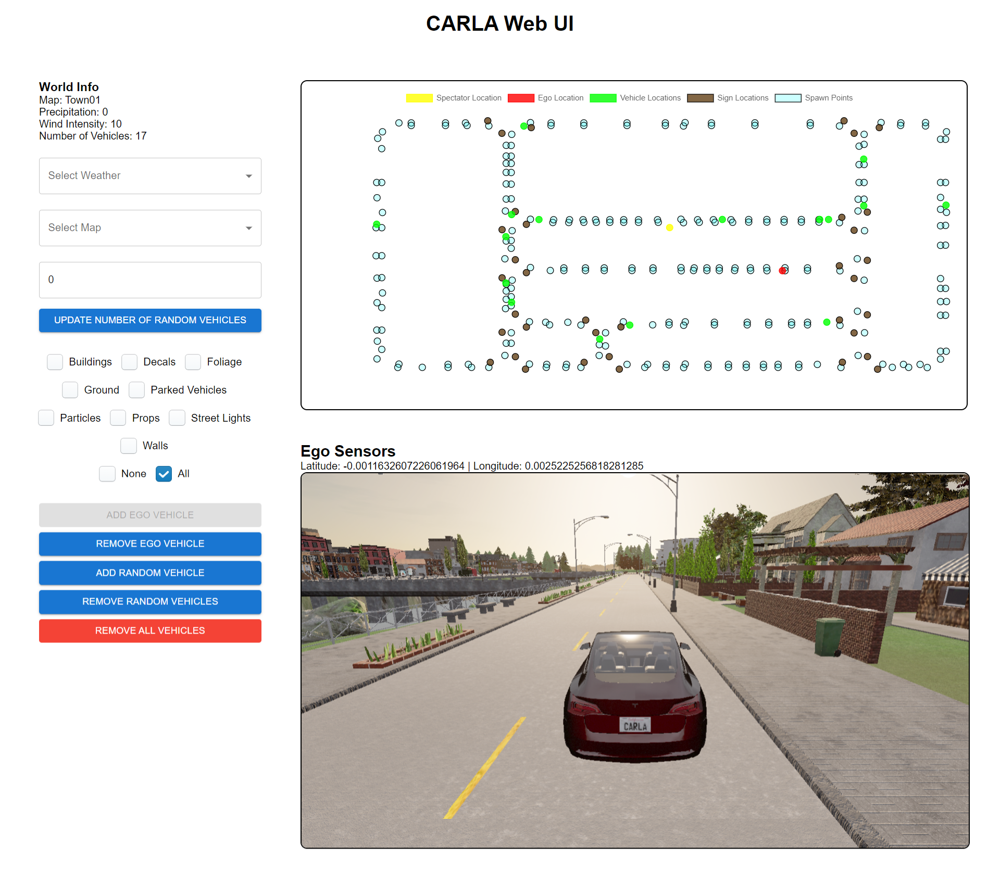

# CARLA Web UI

A browser interface for driving the [CARLA](https://carla.org) autonomous-driving
simulator. CARLA ships a Python client and a set of example scripts; this project
puts a REST API in front of that client and a React single-page application in front
of the API, so a simulation can be set up and inspected without writing a script for
every change.



## What it does

- **Switch maps** and query layout information for the loaded town.
- **Set the weather** from CARLA's presets.
- **Toggle map layers** (buildings, foliage, parked vehicles, street lights and the
  rest) on a loaded town.
- **Spawn and remove an ego vehicle**, and read back the sensors attached to it.
- **Populate traffic**: add or remove random vehicles one at a time, or set a target
  count and let the server reconcile to it.
- **Watch the world live**: actor positions are polled and drawn on a map view, with
  charts for the telemetry.
- **Tear everything down** with a single call.

## Architecture

```
React + TypeScript SPA  ──HTTP──>  Flask API  ──carla.Client──>  CARLA simulator
      (Vite, MUI)                (/api/carla)                     (0.9.15)
      D3 map view
      Chart.js telemetry
```

The server is a thin, stateless translation layer. It holds no simulation state of
its own: every request reads from or writes to the running simulator through the
CARLA Python API, wrapped in `World`, `CameraManager` and `GnssSensor` helper classes.

Two details worth noting:

- **The polling endpoints are cached for one second** (`Flask-Caching`). The UI polls
  for actor positions continuously, and without the cache every client would issue a
  separate synchronous round-trip to the simulator, which slows the simulation itself.
  One second is below the refresh rate a human perceives and well above the cost of a
  simulator query.
- **CORS is scoped to the API blueprint**, so the Vite dev server can talk to Flask
  during development without opening up the whole origin.

### API surface

All routes are mounted under `/api/carla`.

| Method | Route | Purpose |
|---|---|---|
| `GET` | `/world_info` | Weather, active layers and world state |
| `GET` | `/map_info` | Geometry of the loaded town |
| `GET` | `/vehicles` | Positions of every vehicle actor |
| `GET` | `/ego/vehicle` | Whether an ego vehicle exists |
| `GET` | `/ego/sensors` | Sensors attached to the ego vehicle |
| `POST` | `/map` | Load a different town |
| `POST` | `/weather` | Apply a weather preset |
| `POST` | `/layers` | Toggle map layers |
| `POST` | `/ego/add` | Spawn the ego vehicle |
| `DELETE` | `/ego/remove` | Despawn the ego vehicle |
| `POST` | `/random/vehicle/add` | Spawn one random vehicle |
| `DELETE` | `/random/vehicle/remove` | Despawn one random vehicle |
| `POST` | `/random/vehicles` | Reconcile traffic to a target count |
| `DELETE` | `/destroy/all` | Remove every spawned actor |

## Stack

**Client:** React 18, TypeScript, Vite, MUI, D3 for the map view, Chart.js for
telemetry.
**Server:** Flask with Flask-Caching and Flask-CORS, on the CARLA 0.9.15 Python
client.
**Tests:** Jest and React Testing Library for components, Cypress for end-to-end
flows, pytest for the API.

Every UI component has a colocated test, and the Cypress fixtures (`map_info.json`,
`world_info.json`) let the front end be exercised without a running simulator.

## Setup

1. Download the [CARLA 0.9.15 simulator](https://github.com/carla-simulator/carla/releases/tag/0.9.15)
   and start it.

2. Create the Python environment. The CARLA 0.9.15 client wheel requires Python 3.8:

   ```bash
   conda create -n carla-webui python=3.8.18
   conda activate carla-webui
   pip install -r requirements.txt
   ```

3. Clone this repository:

   ```bash
   git clone https://github.com/mateus-aleixo/carla-webui.git
   ```

## Running

With the simulator already running, launch the stack:

- **Windows:** run `webui.bat` as a normal, non-administrator user.
- **Linux:** run `webui.sh`.

Both scripts start the Flask API and the client together.

To work on the front end directly:

```bash
cd client
npm install
npm run dev      # Vite dev server
npm test         # Jest component tests
npx cypress open # end-to-end tests
```

## License

MIT.
